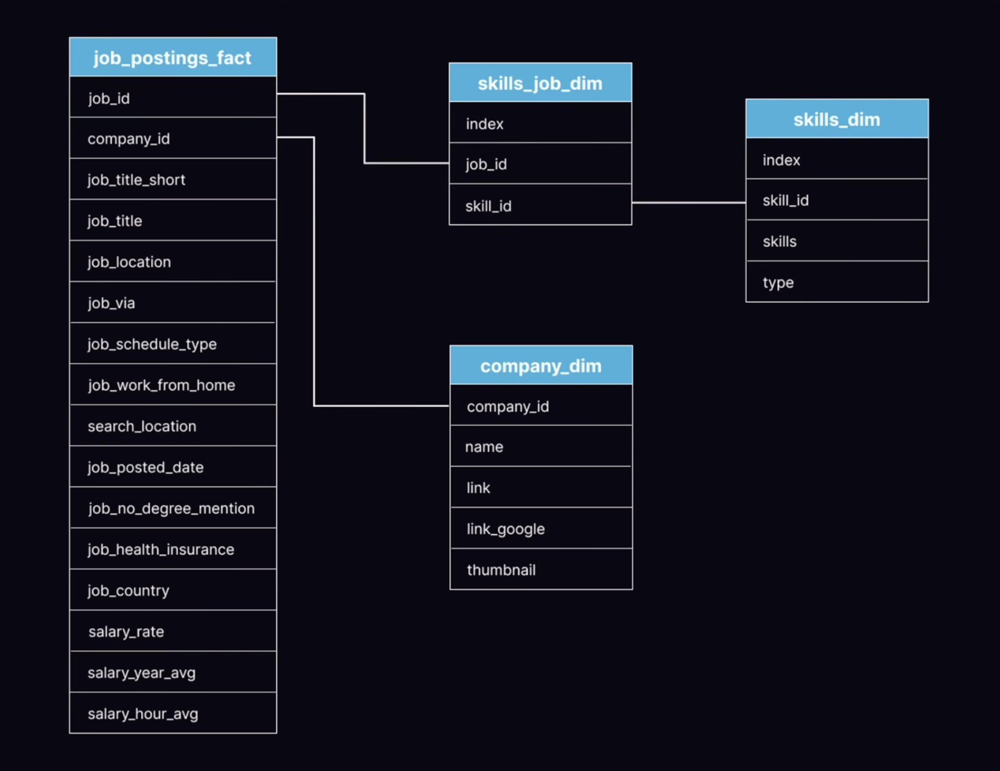

# Data Analyst Job Market Analysis of Year 2023

## Introduction
Dive into the data job market.
Focusing specifically on Data Analyst roles, this project explores top-paying jobs, in-demand skills, and the intersection where high demand meets high salary in data analytics. Using SQL-driven analysis, this repository provides actionable insights for aspiring and practicing data analysts who want to align their skill development with market realities.

SQL queries used in this project can be found here: 👉[[project_sql_folder]](https://github.com/nitinsinghdm/SQL_Project_Data_Job_Analysis/tree/main/project_sql#:~:text=..-,1_top_paying_jobs.sql,-upload%20sql%20files)

## Background
This project was driven by a practical question: How can data analysts navigate the job market more effectively using real data?

Rather than relying on generic advice, this analysis focuses on identifying:

- The highest-paying remote data analyst roles
- The skills required for those roles
- The most in-demand skills across the market
- The skills that command higher salaries
- The optimal skills that balance demand and pay

The dataset comes from my SQL Course
 and includes detailed job posting information such as job titles, salaries, locations, and required skills.


*The Entity Relation Diagram shows us the Fact tabel, along with the Dimension table showcasing differernt Primary and Foreign Key*

## Questions that I Wanted to Answer
1. What are the top-paying data analyst jobs?
2. What skills are required for these top-paying jobs?
3. What skills are most in demand for data analysts?
4. Which skills are associated with higher salaries?
5. What are the most optimal skills to learn?

## Tools I Used
For my deep dive into the data analyst job market, I harnessed the power of several key tools:
- SQL: The backbone of my analysis, allowing me to query the database and unearth critical insights.
- PostgreSQL: The chosen database management system, ideal for handling the job posting data.
- Visual Studio Code: My go-to for database management and executing SQL queries.
- Git & GitHub: Essential for version control and sharing my SQL scripts and analysis, ensuring collaboration and project tracking.

## The Analysis
Each query for this project aimed at investigating specific aspects of the data analyst job market.
Here's how I approached each question:

#### 1. Top Paying Data Analyst Jobs
To identify the highest-paying roles, I filtered data analyst positions by average yearly salary and location, focusing on remote jobs. This query highlights the high paying opportunities in the field.

```sql
SELECT 
    job_id,
    job_title,
    job_location,
    job_schedule_type,
    salary_year_avg,
    job_posted_date,
    name AS company_name
FROM 
    job_postings_fact AS jpf
LEFT JOIN
    company_dim AS cd ON jpf.company_id = cd.company_id
WHERE
    job_title_short = 'Data Analyst' AND 
    job_location = 'Anywhere' AND
    salary_year_avg IS NOT NULL
ORDER BY 
    salary_year_avg DESC
LIMIT 10;
```
**Key Insights**

- **Wide Salary Range:** The top 10 remote Data Analyst roles offer salaries ranging from approximately $184,000 to $650,000, highlighting substantial earning potential.

- **Diverse Employers:** Companies such as Meta, AT&T, and SmartAsset appear, showing that demand for analytics talent spans multiple industries.

- **Title Variation:** High pay is not limited to one title. Roles range from Data Analyst to Director-level analytics positions, reflecting different scopes of responsibility under the analytics umbrella.

#### 2. Skills Required for Top-Paying Data Analyst Jobs
This query builds on the top 10 highest-paying roles and identifies the specific skills associated with them.

```sql
WITH top_paying_jobs AS (
    SELECT 
        job_id,
        job_title,
        salary_year_avg,
        name AS company_name
    FROM 
        job_postings_fact AS jpf
    LEFT JOIN
        company_dim AS cd ON jpf.company_id = cd.company_id
    WHERE
        job_title_short = 'Data Analyst' AND 
        job_location = 'Anywhere' AND
        salary_year_avg IS NOT NULL
    ORDER BY 
        salary_year_avg DESC
    LIMIT 10
)
SELECT 
    top_paying_jobs.*,
    skills
FROM top_paying_jobs
INNER JOIN skills_job_dim AS sjd ON top_paying_jobs.job_id = sjd.job_id
INNER JOIN skills_dim AS sd ON sjd.skill_id = sd.skill_id
ORDER BY
    salary_year_avg DESC;
```
**Key Insights**

- SQL appears in nearly all top-paying roles, reinforcing its importance as a foundational skill.
- Programming skills such as Python and R frequently accompany high salaries.
- Cloud and data platform tools (e.g., Snowflake, Azure, Databricks) appear in senior, high-paying roles.

These jobs emphasize end-to-end analytics capability, not just reporting.

#### 3. Most In-Demand Skills for Data Analysts
This query identifies the most frequently requested skills across all remote Data Analyst job postings.

```sql
SELECT 
    skills,
    COUNT(sjd.skill_id) AS demand_count
FROM job_postings_fact AS jpf
INNER JOIN skills_job_dim AS sjd ON sjd.job_id = jpf.job_id
INNER JOIN skills_dim AS sd ON sd.skill_id = sjd.skill_id
WHERE
    jpf.job_title_short = 'Data Analyst' AND
    job_work_from_home = TRUE
GROUP BY
    skills
ORDER BY
    demand_count DESC
LIMIT 5;
```
**Key Insights**

- **SQL** is the most in-demand skill, appearing more than any other requirement.
- **Python, Excel, and BI** tools follow closely, showing that employers value both technical and business-facing skills.
- Demand reflects core productivity skills, not niche technologies.

#### 4. Skills Associated with Higher Salaries
This analysis calculates the average salary linked to each skill across Data Analyst roles.

```sql
SELECT 
    skills,
    ROUND(AVG(jpf.salary_year_avg), 0) AS avg_salary
FROM job_postings_fact AS jpf
INNER JOIN skills_job_dim AS sjd ON sjd.job_id = jpf.job_id
INNER JOIN skills_dim AS sd ON sd.skill_id = sjd.skill_id
WHERE
    jpf.job_title_short = 'Data Analyst' AND
    salary_year_avg IS NOT NULL
GROUP BY
    skills
ORDER BY
    avg_salary DESC
LIMIT 25;
```
**Key Insights**

- Specialized and less common skills often correlate with higher average salaries.
- These skills typically reflect advanced technical depth or cross-functional expertise.
- However, many of these skills appear in fewer postings, indicating high reward but lower demand.

#### 5. Most Optimal Skills to Learn
This final analysis combines high demand with high average salary, focusing on remote roles.

```sql
SELECT
    sd.skill_id,
    sd.skills,
    COUNT(sjd.skill_id) AS demand_count,
    ROUND(AVG(jpf.salary_year_avg), 0) AS avg_salary
FROM job_postings_fact AS jpf
INNER JOIN skills_job_dim AS sjd ON sjd.job_id = jpf.job_id
INNER JOIN skills_dim AS sd ON sd.skill_id = sjd.skill_id
WHERE
    job_title_short = 'Data Analyst' AND
    salary_year_avg IS NOT NULL AND
    job_work_from_home = TRUE
GROUP BY
    sd.skill_id
HAVING
    COUNT(sjd.skill_id) > 10
ORDER BY
    demand_count DESC,
    avg_salary DESC
LIMIT 25;
```
**Key Insights**

- **SQL** stands out as the most optimal skill, combining strong demand with high salary potential.
- Skills like **Python** and cloud technologies also perform well on both dimensions.
- These skills offer a balance of job security (demand) and financial upside (salary).

# What I Learned
Throughout this adventure, I've turbocharged my SQL toolkit with some serious firepower:
- **Complex Query Crafting:** Mastered the art of advanced SQL, merging tables like a pro and wielding WITH clauses for ninja-level temp table maneuvers.
- **Data Aggregation:** Got cozy with GROUP BY and turned aggregate functions like COUNT () and AVG () into my data-summarizing sidekicks. I
- **Analytical Wizardry:** Leveled up my real-world puzzle-solving skills, turning questions into actionable, insightful SQL queries.

# Conclusions

### Insights
From the analysis, several general insights emerged:
1. **Top-Paying Data Analyst Jobs**: The highest-paying jobs for data analysts that allow remote work offer a wide range of salaries, the highest at $650,000
2. **Skills for Top-Paying Jobs**: High-paying data analyst jobs require advanced proficiency in
SQL, suggesting it's a critical skill for earning a top salary.
3. **Most In-Demand Skills**: SQL is also the most demanded skill in the data analyst job market, thus making it essential for job seekers.
4. **Skills with Higher Salaries**: Specialized skills, such as SVN and Solidity, are associated with the highest average salaries, indicating a premium on niche expertise.
5. **Optimal Skills for Job Market Value**: SQL leads in demand and offers for a high average salary, positioning it as one of the most optimal skills for data analysts to learn to maximize their market value.

### Closing Thoughts
This project enhanced my SQL skills and provided valuable insights into the data analyst job market. The findings from the analysis serve as a guide to prioritizing skill development and job search efforts. Aspiring data analysts can better position themselves in a competitive job market by focusing on high-demand, high-salary skills. This exploration highlights the importance of continuous learning and adaptation to emerging trends in the field of data analytics.